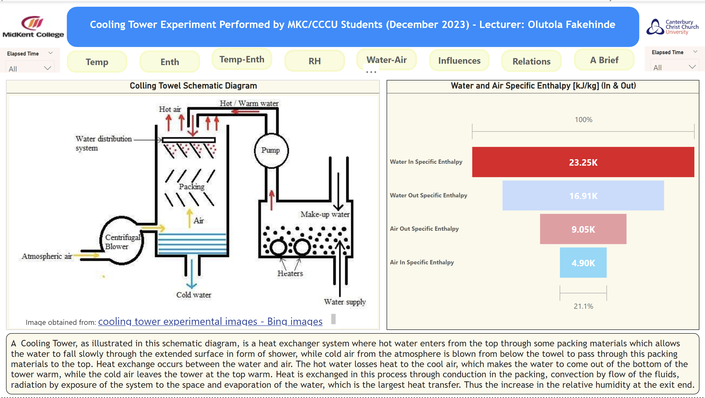
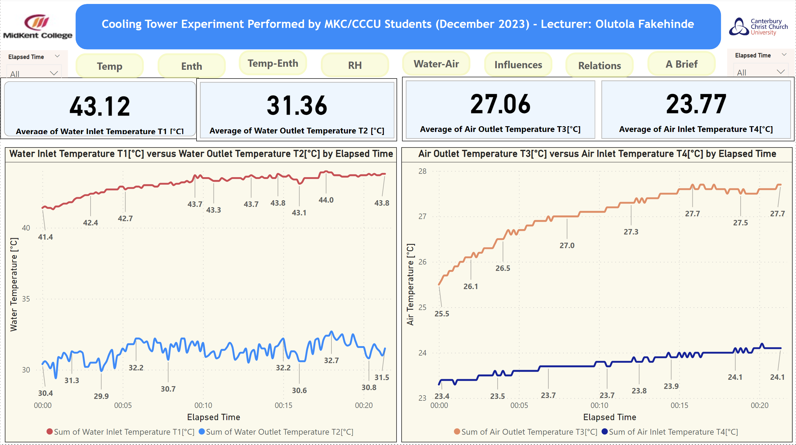
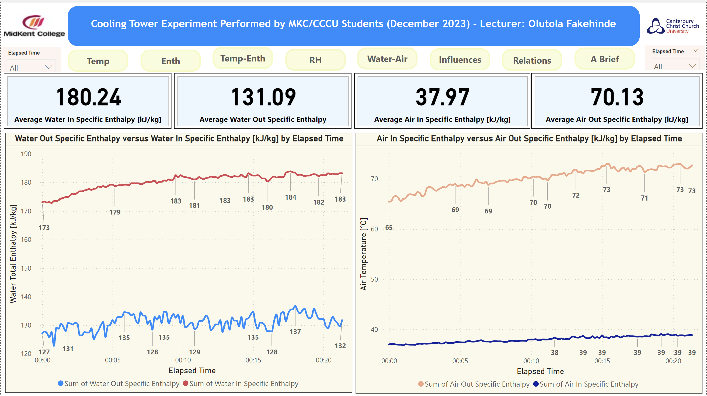
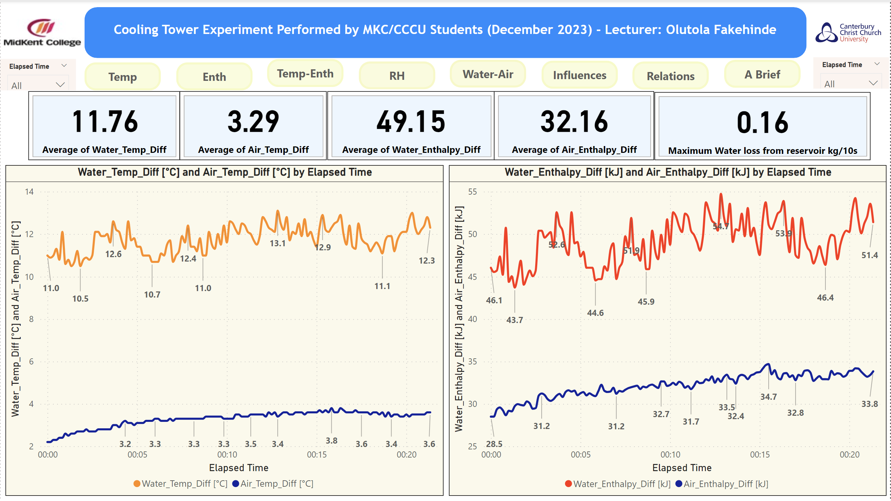
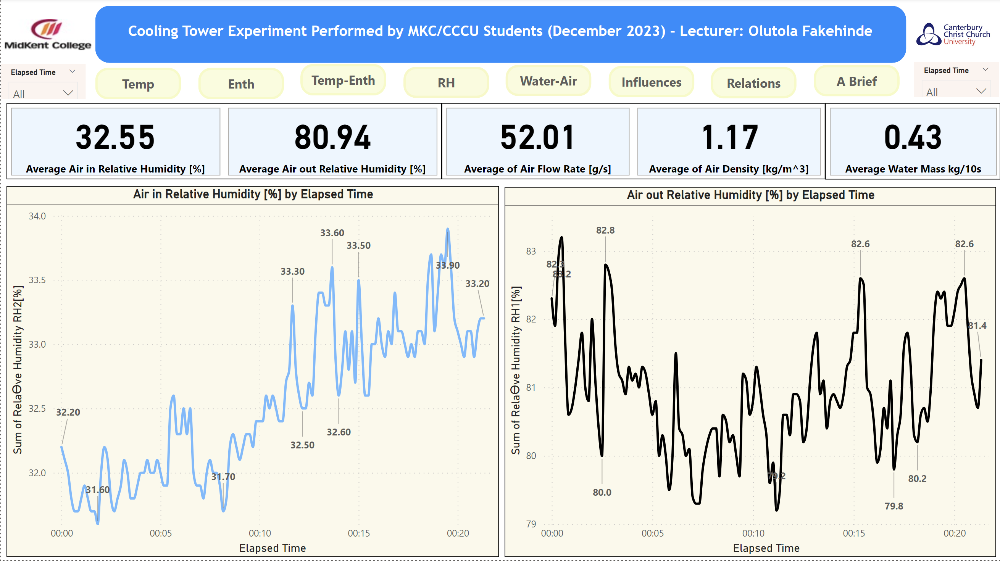
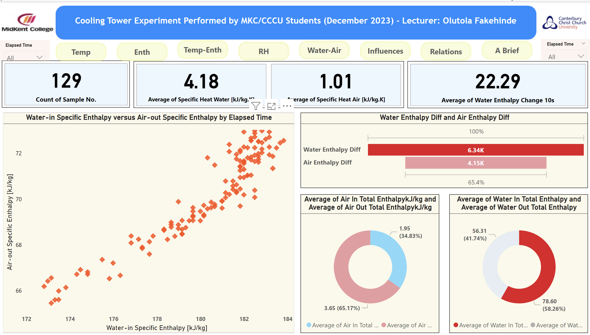
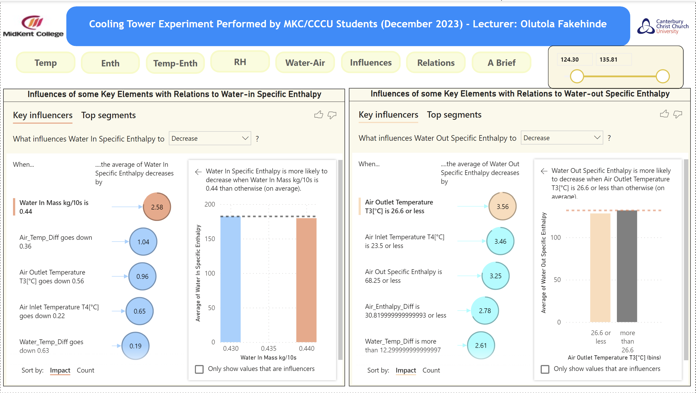
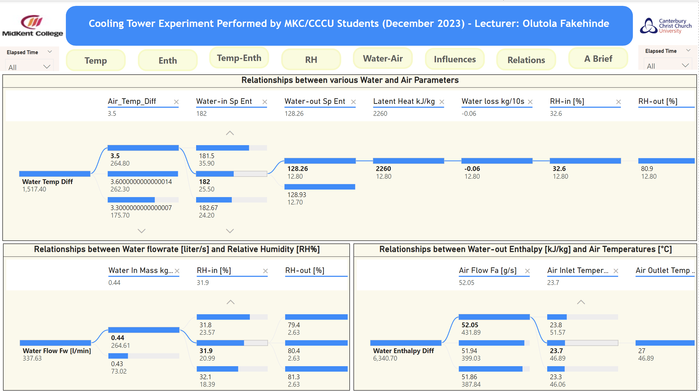

# Cooling-Tower Heat Exchanger Experiment

## Introduction
This Power BI project is on Cooling Tower experiment performed at Christ Church Canterbury University by my students. This is to analysis the rate of heat exchange between two fluids: hot water from a cooling system and cold air from the surrounding ambient.

## Aim of the Project
The aim of this project is to analysis changes in thermodynamics properties of the two fluids (hot water and cold air) has heat is exchange between them as they flow in the opposite directions to each other in the Cooling Tower.

This changes are demonstrated in the following images as generated through Power BI:

## Temperature changes from inlet to outlet in both fluids

This shows that as the water flows in hot at an arrivage of 43.12 degree C, it flows out cooler at an average of 31.36 degree C, while air flow in hcold at average of 27.06 degree C and comes out warmer at average of 23.77 degree C.

## Specific Enthalpy changes from inlet to outlet in both fluids

Water losses energy (enthalpy) from average of 180.24 kJ/kg to average of 131.09 kJ/kg, while air gains energy from average of 37.97 kJ/kg to 70.13 kJ/kg

## Temperature difference and Enthalpy difference in both fluids

From the above, it observed that the average temperature difference drop in water is 11.76 degree C, while air gains average temperature difference of 3.29 degree C.

In the same way, water drops an average energy difference of 49.15 kJ/kg while air gains average energy of 32.16 kJ/kg.

## Air Relative Humidity.

It is observed that as the cold air flows into the Cooling Tower at an average of 32.55%, it picks up water vapour and hence its relative humidity increases flowing out at an average of 80.94%.

## Water-Air contents

This shows several compositions of the fuids.
The scattered diagram shows water in and air out with high enthalpy and the verse in water out and air in.
The funnel chart shows the energy difference the two fluids
The donut charts represented the energy difference in the in and out flow of each fluids.

## Influence of Properties

## Relationships

All the changes in the properties of water and air as shown above are base on many other factors like flow rates, densities both within and without the Cooling Tower and some of these are indicated in the above charts.

## Conclusion
Cooling Towers are heat exchanger which are used in many industries. They are designed to reject unwanted heat from a building, facility or any heat- releasing process inside stations such as power or nuclear ststions and other factories.

Theories behind heat exchangers are in many heat transfer textbooks and journals.
